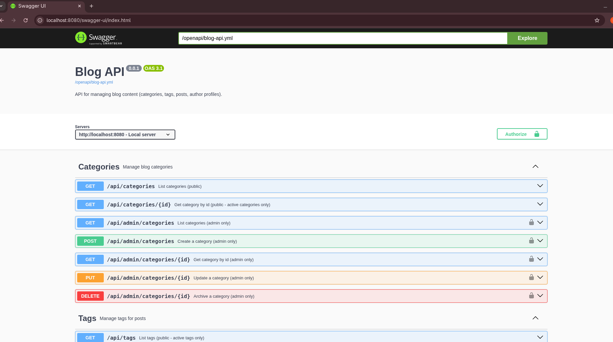
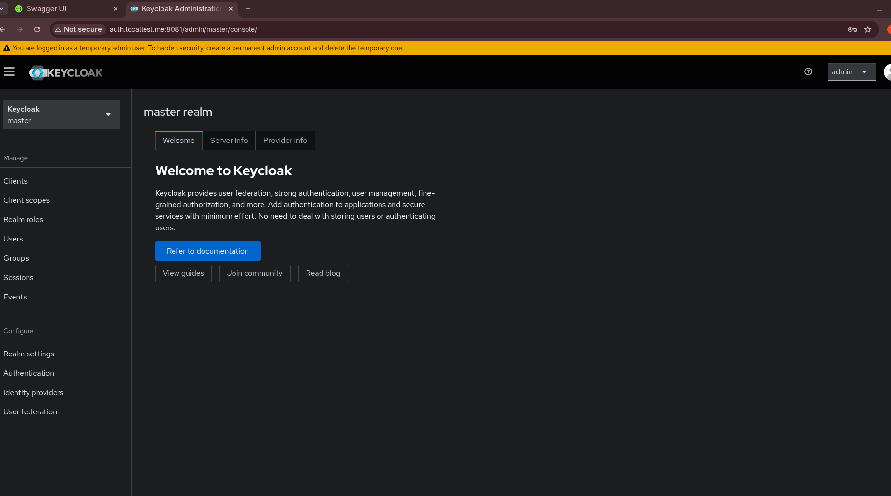
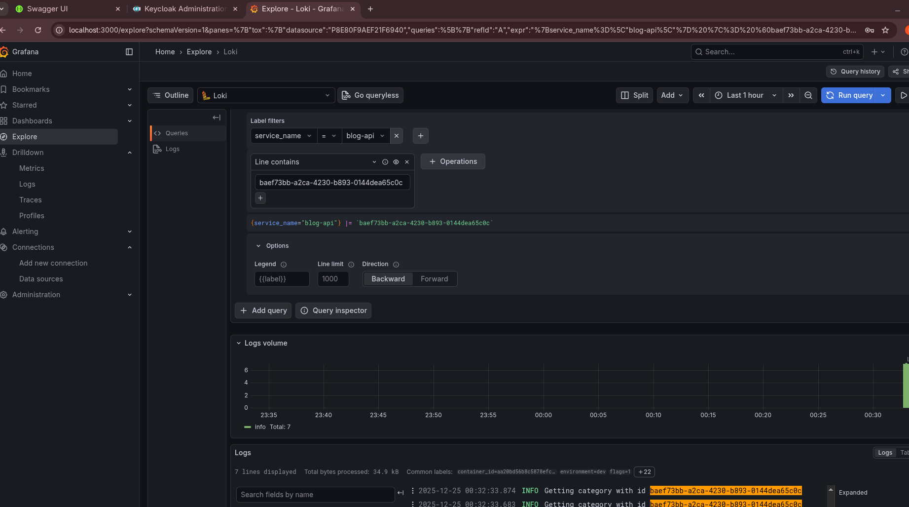
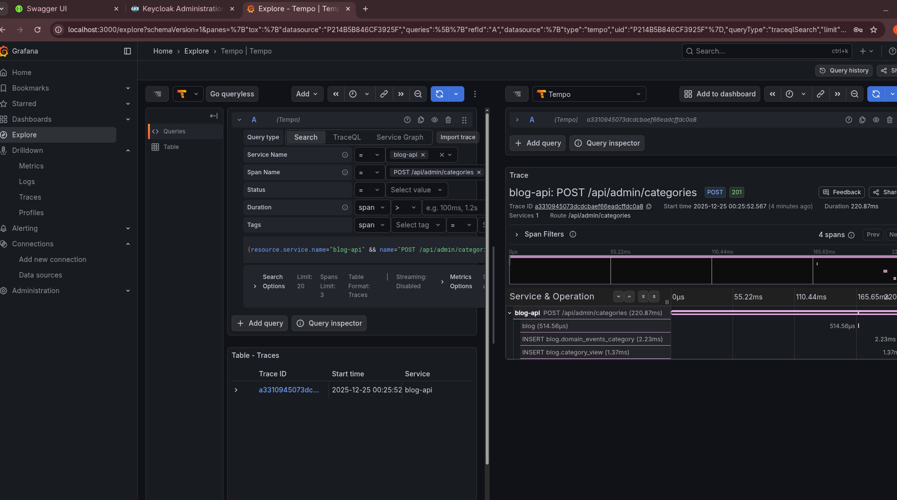
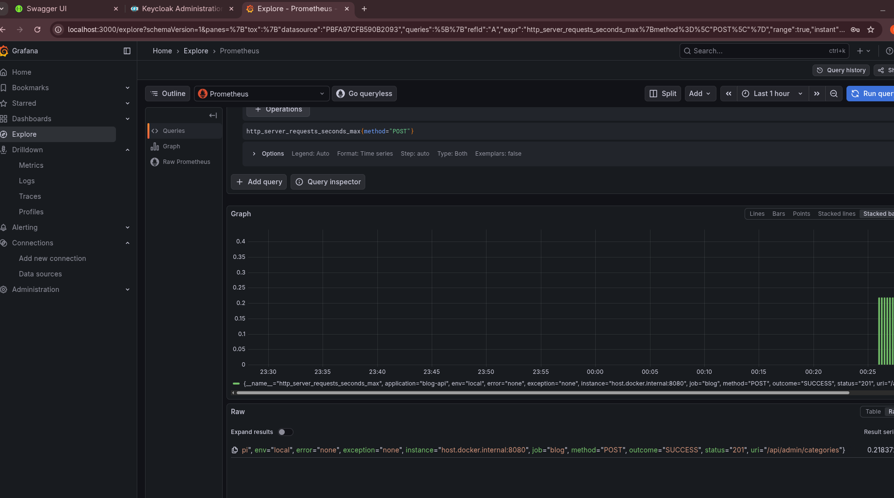
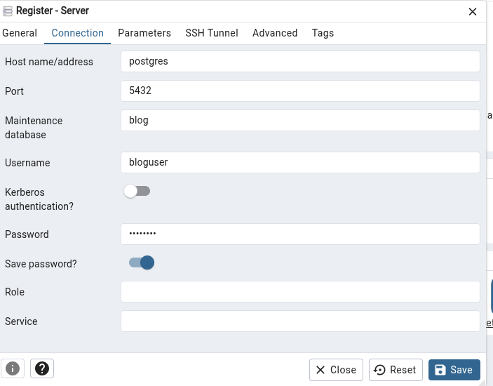
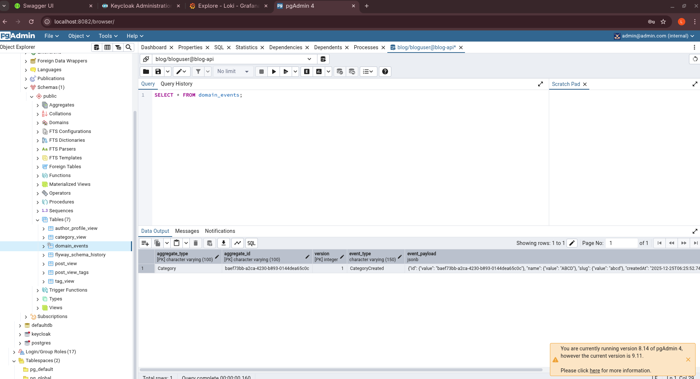

# BLOG APPLICATION

## Description
This is a blog application using hexagonal architecture.\
It is using the next technologies:
- Persistence: **Postgres**
- Authentication/Authorization: **Keycloak**
- Rest API: **Open API V3**
- Framework: **Spring**
- Observabulity: **OTEL + Loki (logs), Tempo (Traces), Prometheus (Metrics)**
- Testing: **JUnit**
- Container: **Docker**

It maakes usage of checkstyle to keep code in specific format and jacoco for test coverage.
Also it is including a set of unit and integration testing.

In this application **ADMIN** can do operations to:
- categories (create, update, archive, list categories pages, list a category).
- tags (create, update, archive, list tag pages, list a tag).
- posts (create, update, publish, archive, list posts page, list a post).
- authorprofile (create, update).

In this application **USER** can do operations to:
- categories (list categories page, list a category).
- tags (list tags page, list a tag).
- posts (list posts page, list a post).
- authorprofile (list a authorprofile).

## Steps to run the application

1.- Execute the script in env/local.sh or copy and paste the commands.\
2.- Execute ```docker-compose up -d```\
3.- Import the collection in [bruno](https://www.usebruno.com/) and test the application or use swagger.\
4.- You will be able to see the info in db, the metrics, traces and logs in grafana.\

Once docker-compose is executed you will have access to the application and different tools:
1. - [Swagger](http://localhost:8080/swagger-ui/index.html)\
Instructions you will be able to use swagger but admin endpoints will require authentication token, you can use the bruno collection **GetJwtToken** request in authentication folder and request a new token, use the user: **luis** and pwd **admin** as those values are in the blogrealm imported to the container.</br></br>
Image to request authentication token:
</br></br>
If you prefer to use bruno you can update the env varibale BEARER_TOKEN with the obtained jwt token.
</br></br>
2. - [Keycloak](http://auth.localtest.me:8081/admin/master/console/#/blogrealm)\
You can make changes here in case you want to add more users, roles, etc (optional).
Use the user **admin** and pwd **admin** to access the admin panel.
</br></br>
3. - [Grafana](http://localhost:3000/login)\
Use the user **gfuser** and the pwd **gfadmin** to have access to the panel then you can go to explore and select loki to check logs, tempo to check traces, prometheus to check metrics.\
Loki:

Tempo:

Prometheus

4. - [PgAdmin](http://localhost:8082/login)\
Use PgAdmin in case you want to see the information in the database, use the user **admin@admin.com** and pwd **admin**.

